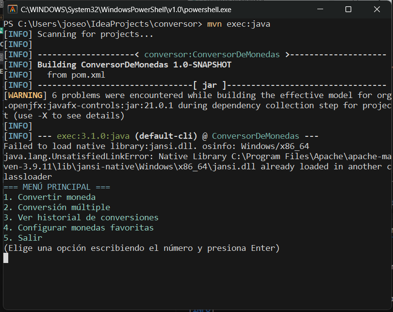
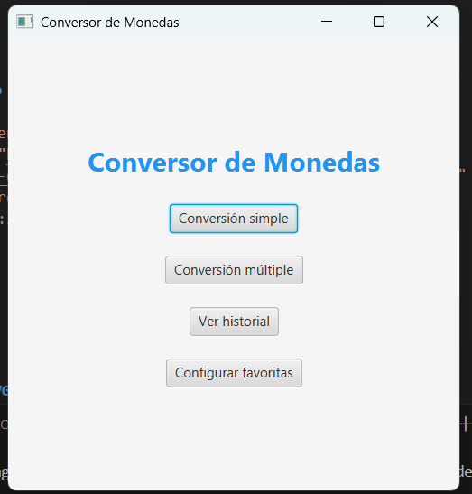

<div align="center">
    <svg width="120" height="120" viewBox="0 0 120 120" fill="none" xmlns="http://www.w3.org/2000/svg">
        <circle cx="60" cy="60" r="55" fill="#2196F3" stroke="#1565C0" stroke-width="5"/>
        <text x="50%" y="50%" dominant-baseline="middle" text-anchor="middle" font-size="48" fill="#fff" font-family="Arial">💱</text>
    </svg>
    <h1 style="font-size:2.5rem; color:#1565C0; font-family:Arial, sans-serif; margin-top:10px;">Conversor de Monedas</h1>
    <p style="font-size:1.2rem; color:#333; font-family:Arial, sans-serif;">Aplicación Java profesional con interfaz gráfica y consola</p>
</div>

---


---

<div align="center">
    
    
    
    
</div>

---

## 🚀 Descripción

**Conversor de Monedas** es una aplicación profesional en Java que permite convertir entre más de 150 monedas en tiempo real. Incluye:

- Interfaz gráfica moderna con JavaFX
- Modo consola interactivo
- Conversión múltiple y simple
- Historial persistente y monedas favoritas
- Colores y experiencia de usuario avanzada

---


---

## 💡 Características principales

<ul>
    <li><b>Interfaz gráfica moderna (JavaFX)</b></li>
    <li><b>Modo consola interactivo</b></li>
    <li>Conversión en tiempo real mediante API</li>
    <li>Más de 150 monedas disponibles</li>
    <li>Conversión múltiple en una sola consulta</li>
    <li>Historial con fecha y hora</li>
    <li>Configuración de monedas favoritas</li>
    <li>Colores en consola para mejor experiencia</li>
    <li>Código limpio, modular y orientado a objetos</li>
</ul>

---


---

## 💻 Ejecución

<details>
    <summary><b>Versión consola</b></summary>

    ```bash
    mvn exec:java
    ```
</details>

<details>
    <summary><b>Versión gráfica (JavaFX)</b></summary>

    ```bash
    mvn javafx:run
    ```
</details>

---


---

## 📂 Estructura del proyecto

```text
conversor/
├── src/main/java/conversor/
│   ├── Main.java           # Menú y lógica consola
│   ├── Conversor.java      # Lógica de conversión
│   ├── ApiService.java     # Conexión a la API
│   ├── ConversorFX.java    # Interfaz gráfica JavaFX
│   └── util/Consola.java   # Utilidades de colores en consola
├── historial.txt           # Historial de conversiones
├── favoritas.json          # Monedas favoritas
├── pom.xml                 # Configuración Maven y dependencias
└── README.md               # Documentación
```

---


---

## 🛠️ Tecnologías utilizadas

<ul>
    <li>Java 11+</li>
    <li>JavaFX</li>
    <li>Gson</li>
    <li>Jansi (colores en consola)</li>
    <li>Maven</li>
</ul>

---


---

## 🌐 API utilizada

- <a href="https://www.exchangerate-api.com/" target="_blank">ExchangeRate API</a>

---


---

## 📄 Ejemplo de uso


<div align="center">
    <table>
        <tr>
            <td align="center">
                    
                <br/>
                <b>Interfaz gráfica (JavaFX)</b>
            </td>
            <td align="center">
                    
                <br/>
                <b>Modo consola</b>
            </td>
        </tr>
    </table>
</div>

---


---

## 🖌️ Logo SVG profesional

El logo SVG se muestra arriba. Puedes personalizarlo en `.github/conversor.svg` o usar el que está en el README.

---


---

## ✨ Autor

- [@joseorteha](https://github.com/joseorteha)

---


---

## 📨 Contribuciones

Las contribuciones son bienvenidas. Si deseas mejorar este proyecto, abre un <b>Pull Request</b> o reporta un <b>Issue</b>.

---

<div align="center">
    <sub>Desarrollado con ❤️ en Java</sub>
</div>
